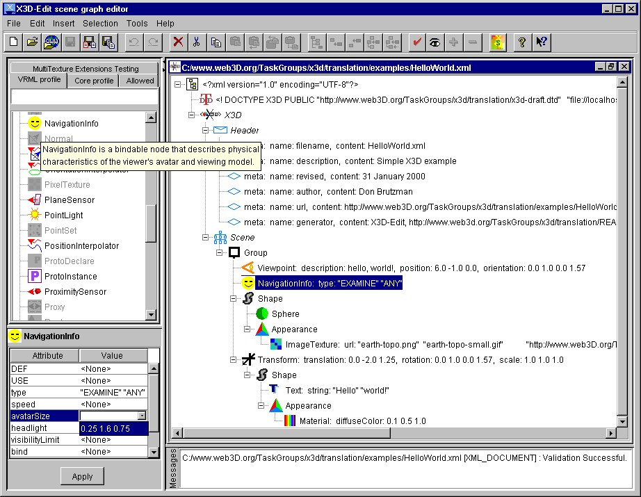

# X3D-Edit v3.1

this file now replaced by

    http://www.web3d.org/TaskGroups/x3d/translation/README.X3D-Edit.html

==============================================================================

    README.X3D-Edit.txt  -  Installing Xeena and editing X3D files

    http://www.web3d.org/x3d/translation/README.X3D-Edit.txt

## Purpose:

X3D-Edit is an Extensible 3D (X3D) graphics file editor that
             uses the X3D Document Type Definition (DTD) in combination
             with Sun's Java, IBM's Xeena XML editor, and an editor profile
             configuration file.  X3D-Edit enables simple error-free editing,
             authoring and validation of X3D or VRML scene-graph files.

Revised:     29 February 2004

Released:    1 November 1999

Version:     1.4 beta now with GeoVRML and H-Anim node support, using
             x3d-compromise.dtd and wrapper tags, with Xeena 1.2 EA release

Author:      Don Brutzman     brutzman@nps.navy.mil

### Distribution:
    http://www.web3d.org/x3d/translation/X3D-Edit.zip
    http://www.web3d.org/x3d/translation/X3D-Edit.tar.gz

### Example content:
    http://www.web3d.org/x3d/translation/X3D-Examples.zip
    http://www.web3d.org/x3d/translation/X3D-Examples.tar.gz

### Screen snapshots:
    X3D-EditSampleScreenSnapshot.png
    http://www.web3d.org/x3d/translation/X3D-EditSampleScreenSnapshot.png
    http://www.web3d.org/x3d/translation/examples/GeoVrml/newGeoVrmlScene.png

## Features:

 *    Intuitive user interface
 *    Always creates well-formed scene graphs:  nodes only fit where allowed
 *    Validates X3D scenes for VRML 97 profile and Core profile
 *    Platform independence using Java
 *    Tool tips and hints help you learn how VRML/X3D scene graphs really work
 *    GeoVRML 1.0 profile support http://www.geovrml.org/1.0/doc
 *    H-Anim  1.1 profile support http://ece.uwaterloo.ca:80/~h-anim/spec1.1
 *    Automatically translate into VRML and launch browser to view results
 *    Extensible Style Sheet (XSL) translation:  X3dToVrml97.xsl, X3dToHtml.xsl
 *       X3dUnwrap.xsl and X3dWrap (for wrapper tag addition/removal)
 *    Design testing & evaluation of MultiTexture extension nodes included

### Icon summary sheets:

icons/IconSheet-1.pdf
icons/IconSheet-2.pdf
icons/IconSheet-3.pdf

    http://www.web3d.org/x3d/translation/icons/IconSheet-1.pdf
    http://www.web3d.org/x3d/translation/icons/IconSheet-2.pdf
    http://www.web3d.org/x3d/translation/icons/IconSheet-3.pdf

## Status:

X3D-Edit is being used to develop and test the Extensible 3D (X3D)
    Document Type Definition (DTD) tagset.  X3D-Edit also exercises
    various X3D graphics rendering and translation implementations.

We're using X3D-Edit to teach a VRML class - it works great!  Suggestions
    and improvements regarding X3D-Edit installation/usability are welcome.

Additional instructions for Mac are available in README.X3D-Edit.Mac.txt
    thanks to the ever mac-nificent Steve Guynup <guynups@gra.com>
    
Information about X3D & next-generation VRML graphics is available at
    http://www.web3d.org/x3d.html

* Version 1.4 corresponds to x3d-compromise.dtd (July     2000) + extensions
* Version 1.3 corresponds to x3d-compromise.dtd (May      2000)
* Version 1.2 corresponds to x3d-compromise.dtd (April    2000)
* Version 1.1 corresponds to x3d-draft.dtd      (February 2000)

## Licensing:

X3D-Edit files are open-source public-domain products from the X3D
    Task Group.  The Sun license for Java and the nonrestrictive IBM 
    license for Xeena are provided when downloading/installing those tools.

## Installation instructions:

1.  Download and install Xeena from IBM Alphaworks
    http://www.alphaWorks.ibm.com/tech/xeena

2.  Install Java JDK 1.3 (also called Java 2 SDK, Standard Edition
    Version 1.3) from
    http://www.javasoft.com/nav/download

3.  Download the X3D-Edit distribution (~350 KB) from
    http://www.web3d.org/x3d/translation/X3D-Edit.zip
    http://www.web3d.org/x3d/translation/X3D-Edit.tar.gz

    If you need an unzip program, get PKZIP from http://www.pkware.com/
    or use Java as follows:
       C:\> jar -xvf X3D-Edit.zip

    Make sure your unzip preferences preserve the subdirectory folder names
    and install into your top-level directory on __C:/__
    (it unravels into C:\www.web3d.org\x3d\translation\* )

4.  Optional:  download the X3D-Examples distribution (~1 MB) from
    http://www.web3d.org/x3d/translation/X3D-Examples.zip
    http://www.web3d.org/x3d/translation/X3D-Examples.tar.gz

    Make sure your unzip preferences preserve the subdirectory folder names
    and install into your top-level directory on __C:/__
    (it unravels into C:\www.web3d.org\x3d\translation\* )

5.  If you insist on changing the installation directory (!) -
    well OK, then you need to edit the second line (DOCTYPE) of
    - x3d/translation/x3d-compromise.dtd

    and you will also need to edit the following files:
    - x3d/translation/x3d-compromise.profile.Xeena-1.3
    - x3d/translation/X3D-Edit.bat
    - x3d/translation/Makefile          (if used)
    to match your local directory structure.  You will likely have
    to edit the examples as well, though Xeena will also try to find
    the website version of the DTD.

Usage:
    
6.  Windows:

    C:
    cd \www.web3d.org\x3d\translation
    X3D-Edit.bat

    Note:  we are currently using Xeena 1.1 and X3D-Edit-1.3.bat

7.  Unix:

    source xeena.sh

    source x3d-edit.sh

Alternate Usage:
    
8.  Besides X3D-Edit.bat, example Xeena editor invocations under Windows follow.
    Edit for your locally installed subdirectories as needed.

C:\ibm\Xeena> 
xeena.bat  -dtd c:\www.web3d.org\x3d\translation\x3d-compromise.dtd  -root X3D

C:\ibm\Xeena> 
xeena.bat  -dtd c:\www.web3d.org\x3d\translation\x3d-compromise.dtd  -root X3D  -xml c:\www.web3d.org\x3d\translation\examples\AllVrml97Nodes.xml

9.  There are many example invocations and shortcuts in the Makefile.

Extra Stuff:

10. X3D to VRML 97 translation is now available via XSL script at
    http://www.web3d.org/x3d/translation/X3dToVrml97.xsl

    There are few compliant Extensible Stylesheet Language (XSL)
    processors available because the W3C XSL Recommendation
    http://www.w3.org/TR/xslt is fairly recent (November 1999).
    One excellent XSL transformation engine is SAXON at
    http://users.iclway.co.uk/mhkay/saxon - this includes
    "Instant Saxon," a 250KB Windows command-line executable.
    X3dToVrml97.bat shows how to invoke saxon and the following tools.

    X3D to HTML translation is also provided (for pretty printing) via
    http://www.web3d.org/x3d/translation/X3dToVrml97.xsl
 
    Trapezium's vorlon tool for VRML syntax checking at
    http://www.trapezium.com
    
    Bob Crispen's vpp tool at http://hiwaay.net/~crispen/vrml/ 
    for VRML pretty printing.  An edited copy of vpp is included in this
    distribution with bigger MAXBUFSIZE for our big test-file comments.

    Example source     -> translation example:  make saxon
      results in
    examples/AllVrml97Nodes.xml -> examples/AllVrml97NodesStyledPretty.wrl

11. Added MultiTexture extensions for initial design testing and
    evaluation.  See MultiTextureExamples-1.xml file.  Moving target.

12. Xeena bug list:

    IBM Haifa has been very attentive in responding to bug reports
    regarding Xeena, the interface tool.  X3D/Xeena bug reports/resolution
    are recorded in
    http://www.web3d.org/x3d/translation/examples/AllVrml97Nodes.wrl
    http://www.web3d.org/x3d/translation/examples/AllVrml97Nodes.xml

    From the Xeena README (file:///C|/IBM/Xeena/README.html)

> If you're running Windows 95, and encounter an "Out of environment space" 
> error, then you'll need to increase the size of the environment table.  
> You can do this at the command line (which is temporary) or by editing 
> a configuration file to make a permanent change (which requires restarting 
> your computer). 
> 
>      To temporarily increase environment space, 
>      enter the following at the DOS prompt: 
> 
>          command /e:8192 
> 
>      To permanently increase environment space, 
>      add the following line to your CONFIG.SYS file 
>      and then restart your system: 
> 
>          shell=command.com /e:8192 /p 
> 
>      Once you've increased the size of the environment table, try running
>      Xeena again. 

13. Some extra hints are present in support of MultiTexture-related tags
    and other experimental work.  Please ignore, or feel free to ask
    brutzman@nps.navy.mil if you're wondering.
    
14. X3D specification developers' department:

    Developers might not have Make installed...  'Make' is available
    via the Cygnus distribution of GNU Utilities for PCs at 
    http://sourceware.cygnus.com/cygwin
    Provides Unix command line and utilities on Windows 95/98/NT. 
    Don't forget to upgrade your PATH with something like 
    C:\cygnus\cygwin-b20\H-i586-cygwin32\bin;

    Once Make is installed, edit the Makefile filename/directory
    definitions to match your local installation.

    There are a bunch of alternate example invocations in the Makefile
    if you grok Make.

